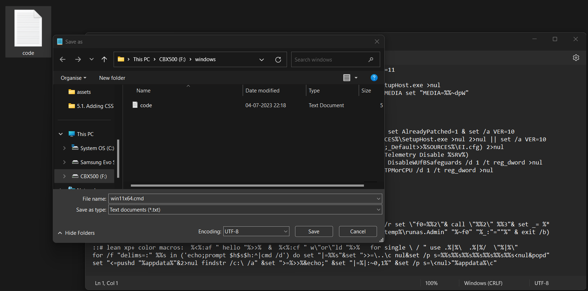
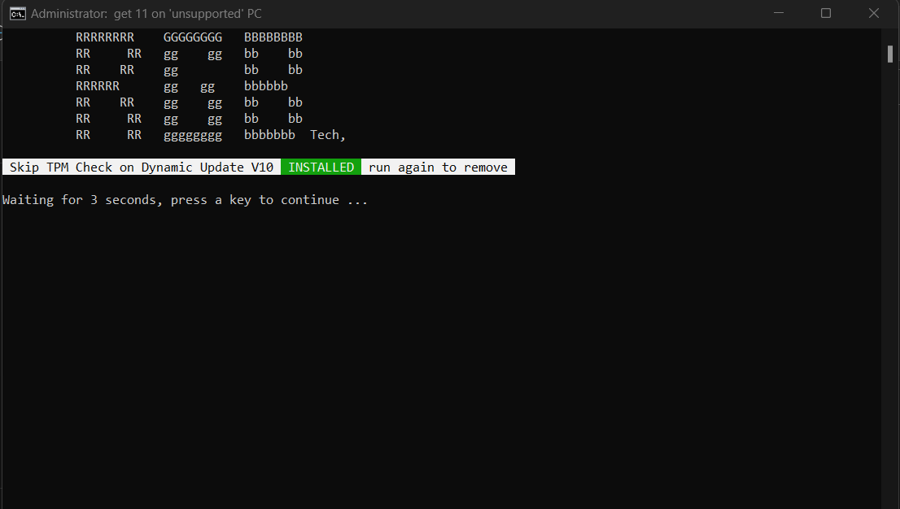
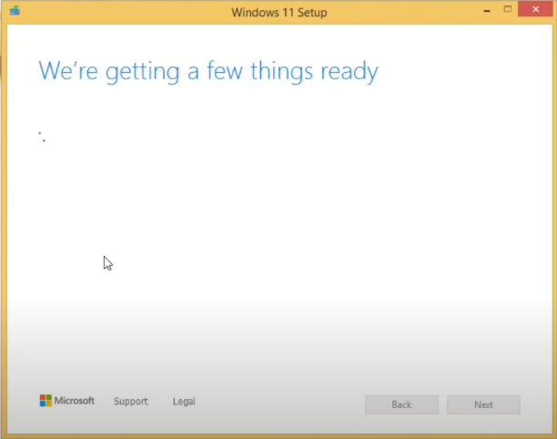

# W11x64.bat
Win11 Fix on "Unsupported PC", "No TPM", "Unsupported CPU" x64 Hardware only. 

# How to Fix Error!
- copy or download the above code.txt file.
- open text editor, paste the code.
- now after that save file as "win11x64.cmd" so that a batch file is created aside.
  
- now run that batch file as "admin" thats it, as it shows "Skip TPM Check on Dynamic Update V10  INSTALLED  run again to install", enter..
  
- now go to your setup dir./ and load the setup file (works for 11 only) wait untill it shows "getting few things ready.." means Problem Fixed!
  

# minimum working requirements:
- based on win11 x64 22h2 version.
- Processor: intel or AMD x64, ARM based Dual core or faster 1Ghz (64bit only)
- 4GB RAM or (atleast 2GB RAM)
- Graphics card Compatible with WDDM 1.2 Driver or higher. 
- 40GB Disk Space
- 800x600 Display. (1024x768 or higher better)

# Official Requirements:
- Processor: 1Ghz or faster with 2 or more cores on a compatible 64-bit processor or System on a Chip (SoC).
- 4GB RAM.
- Storage: 64 GB disk space
- System firmwareUEFI, Secure Boot capable. Check here for information on how your PC might be able to meet this requirement.
- TPMTrusted Platform Module (TPM) version 2.0. Check here for instructions on how your PC might be enabled to meet this requirement.
- Graphics card Compatible with DirectX 12 or later with WDDM 2.0 driver.
- 1280x720 or higher, 8bit color.
- Internet connection and Microsoft accountWindows 11 Home edition requires internet connectivity and a Microsoft account. Switching a device out of Windows 11 Home in S mode also requires internet connectivity. Learn more about S mode here. For all Windows 11 editions, internet access is required to perform updates and to download and take advantage of some features. A Microsoft account is required for some features.

# Win 11 Tested on Unsupported PCs Source videos.
1. Win11 on Very Oldest Pentium D (65nm) x64 based PC from 2006 Tested [win11_pentiumD](https://youtu.be/pPW52VAtSVU)
2. win11 on pentium 4 (1 core) 90nm x64 [win11 on pentium4](https://youtu.be/Z0nYgME8knY)
3. win11 on unsupported pc intel 7th gen or lower Fix [windows 11 Fix on unsupported pc (2021)](https://youtu.be/D5RJGX14CGA)

# Other sources
1. improve performance, HDD/SSD drive disk slow down Fix [win11_perf](https://youtu.be/lIz6i3NsvDg)
2. Fix GRUB boot loader error [Fix grub boot/remove](https://youtu.be/O6rJG27r2Jw)

# about windows
[about windows 11](https://en.wikipedia.org/wiki/Windows_11)
